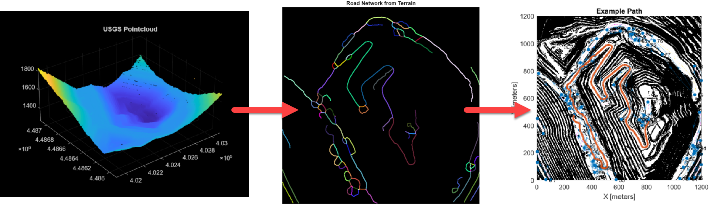
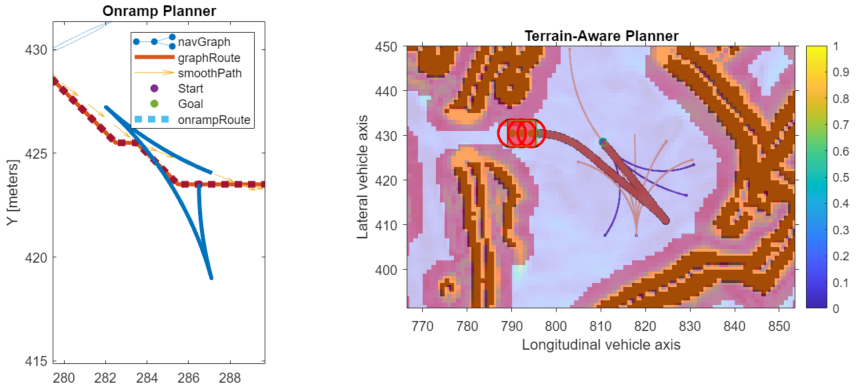
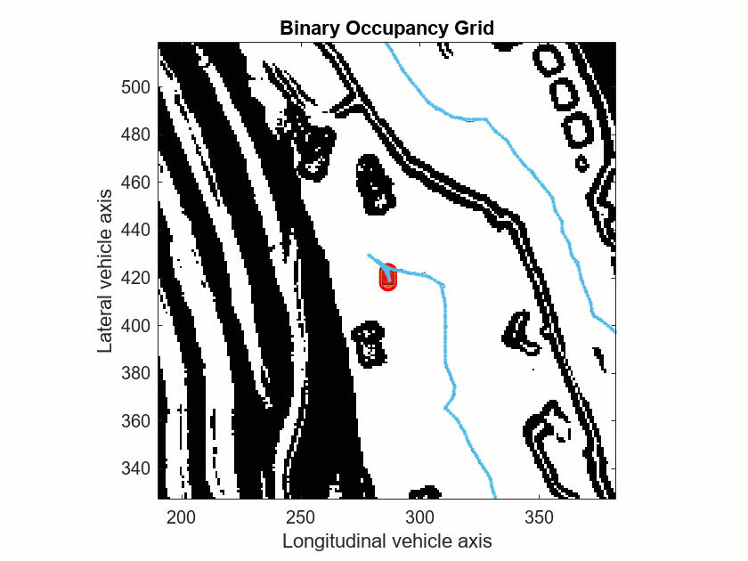
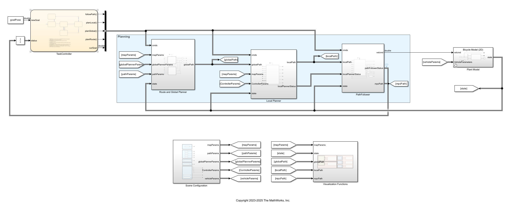

# Offroad Navigation for Autonomous Haul Trucks in Open Pit Mine
<!-- This is the "Title of the contribution" that was approved during the Community Contribution Review Process --> 

<!-- Add this icon to the README if this repo also appears on File Exchange via the "Connect to GitHub" feature --> 

Hauling material in an open pit mining requires a planning stack capable of both navigating at the global scale and avoiding obstacles during local path following. Navigation Toolbox&trade; offers planners and controllers that serve well for 2-D indoor planning but they can also be extended for 2.5-D offroad navigation. You can do this by deriving structure from terrain and incorporating heuristics into the planners to account for changes in elevation or slope. The solution proposed by this repository approaches the offroad navigation problem in three steps described in these three MLX files:

1.  `CreateRoutePlannerUsingDigitalElevationData.mlx` — Process digital elevation data into a road network for route planning.  

  

2.  `CreateTerrainAwareGlobalPlanners.mlx` — Create an onramp planner that enables the autonomous haul truck to drive onto the road network while avoiding obstacles. This example also creates a terrain-aware planner for situations where the onramp planner cannot find a path to the road network.  

  

3.  `CreateLocalPlannerToNavigateGlobalPath.mlx` — Create a planner for following global reference paths while satisfying the kinematic and geometric constraints of the haul truck.  

  

Lastly, the repository has the  `ModelAndControlAutonomousHaulTruck` MLX file. This file shows how to use Simulink&reg; to integrate the road network and planners into an autonomous navigation stack with logic controlled by Stateflow&reg;.  

This figure shows the top-level of the autonomous navigation stack.

### MathWorks Products (https://www.mathworks.com)

Requires MATLAB release R2023b or newer
- [MATLAB&reg;](https://www.mathworks.com/products/matlab.html)
- [Simulink&reg;](https://www.mathworks.com/products/simulink.html)
- [Navigation Toolbox&trade;](https://www.mathworks.com/products/navigation.html)
- [Computer Vision Toolbox&trade;](https://www.mathworks.com/products/computer-vision.html)
- [Image Processing Toolbox&trade;](https://www.mathworks.com/products/image.html)
- [Automated Driving Toolbox&trade;](https://www.mathworks.com/products/automated-driving.html)
- [Stateflow&reg;](https://www.mathworks.com/products/stateflow.html)

## Installation
Installation instuctions

1. MATLAB installation: Visit installation instructions [webpage](https://in.mathworks.com/help/install/) to get started with the MATLAB installation process. 
2. Ensure that the products mentioned under MathWorks Products above are installed.

## License
<!--- Make sure you have a License.txt within your Repo --->

The license is available in the license.txt file in this GitHub repository.

## Community Support
[MATLAB Central](https://www.mathworks.com/matlabcentral)

Copyright 2023 The MathWorks, Inc.

<!--- Do not forget to the add the SECURITY.md to this repo --->
<!--- Add Topics #Topics to your Repo such as #MATLAB  --->

<!--- This is my comment --->

<!-- Include any Trademarks if this is the first time mentioning trademarked products (For Example:  MATLAB&reg; Simulink&reg; Trademark&trade; Simulink Test&#8482;) --> 

